# Roteiro instalação debian 11.0.0 usando o VirtualBox

## **1ª Etapa configuração Máquina Virtual**
- 1. Este tutorial presume que você tenha o [VirtualBox] (https://www.virtualbox.org/) já instalado.
- 1. Clique no link [debian.org](https://cdimage.debian.org/debian-cd/current/arm64/iso-dvd/debian-11.0.0-arm64-DVD-1.iso)  para fazer o download da versão 11.0.0, que é a versão stable na data de confecção deste roteiro
- 2. Terminado o download da iso abra o virtual box,  **Clique em novo**, escreva um nome, escolha a pasta onde será salvo os arquivos da máquina ou deixe o padrão, mude o tipo para linux e a para versão debian x64. 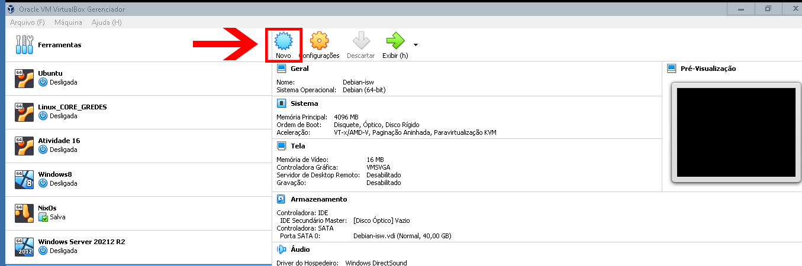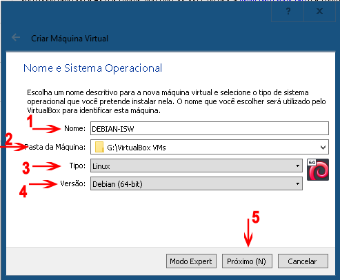
- 3. Clique em próximo, coloque a ram em 4096mb  
- 4. Clique em próximo, marque a opção **criar um novo disco rigído virtual agora** e clique em criar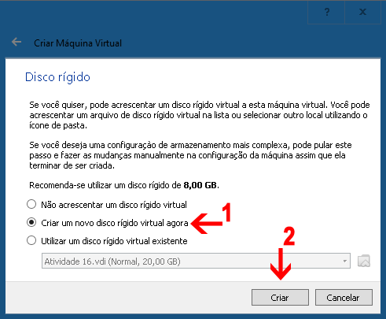
- 5. Continue o processo de criação, marque a opção VDI (Virtual Disk Image) e clique em próximo. 
- 6. Marque a opção Dinamicamente alocado e clique em próximo. 
- 7. Selecione o tamanho da imagem de disco virtual entre 20G a 40GB  
- 8. Após a máquina virtual ter sido criada clique em **configurações** e selecione a **ISO do debian** que você fez o download e **clique em abrir**  
- 9. Agora clique em iniciar para ligar a máquina virtual 
## **Instalação da Distro do Debian 11 na máquina virtual**
- 1. Selecione a forma que você prefere que a instalação ocorra iremos usar a **Graphical install**  
- 2. Nos próximos passos você irá configurar linguagem. localidade e teclado da distro
     - 2.1 Selecionar a linguagem da instalação
    
     - 2.2 Selecionar sua localidade (País) para configurar o fuso horário 
    
     - 2.3 Selecionar a configuração do teclado
    
- 3.  Clique em continue e aguarde o instalador carregar os componentes de instalação e configuração dos componentes de rede.
- 4.  Agora defina o hostname no exemplo foi definido **server-isw**, você pode por qualquer um desde que respeite as regras da distro apenas letras minúsculas (a-z), ou maiúsculas (A-Z), numeros de (0-9) e o sinal de hífen(-)
    
- 5. Defina o nome de dominio do seu servidor "exemplo.com.br"
    
- 6.  Defina a senha do usuário **root**
    
- 7. Configure uma conta para tarefas não-administrativas
      - 7.1 Defina o nome completo do usuário
    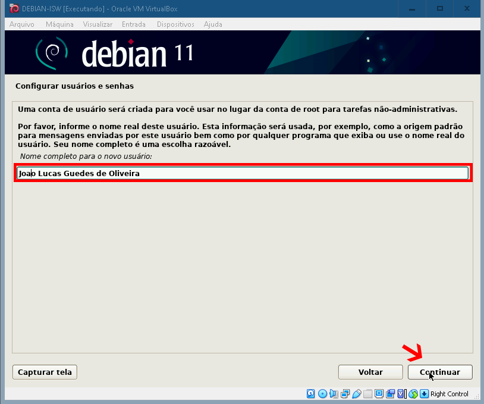
      - 7.2 Defina o nome de usuário
    
      - 7.3 Defina a senha do usuário
    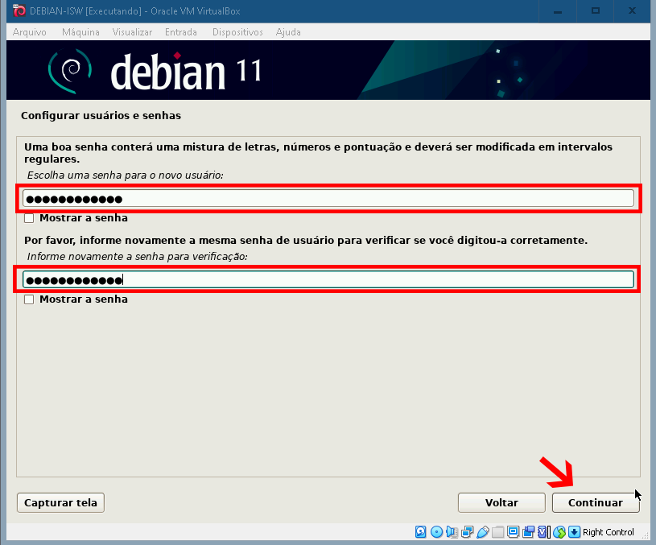
- 8. Configurar o fuso horário do rélogio.
    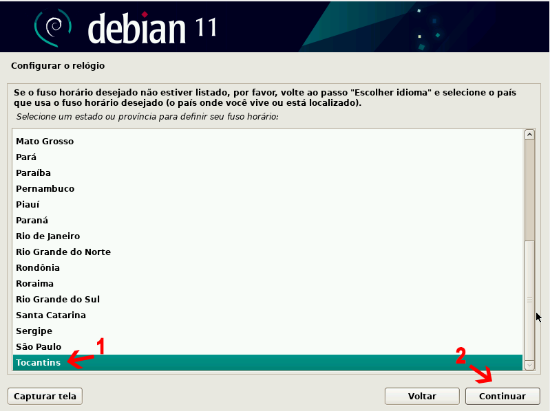
- 9.  Vamos configurar o particionamento de disco 
      - 9.1.  selecione **"Assitido - usar o disco inteiro"**
    
      - 9.2.  Selecione o disco que será particionado
    
      - 9.3 Selecione o esquema de particionamento **Todos os arquivos em uma partição ( para iniciantes )**
    
      - 9.4 Confirme o particionamento do disco marque a opção **Finalizar o particionamento e escrever as mudanças no disco**
    
      - 9.5 Confirme clicando em **SIM** para escrever as mudanças no disco que será particionado e continue
    
- 14.  Agora vamos configurar o gerenciador de pacotes
        - 14.1 Como não temos midias adicionais para serem lidas podemos marcar **NÃO** e continuar.
        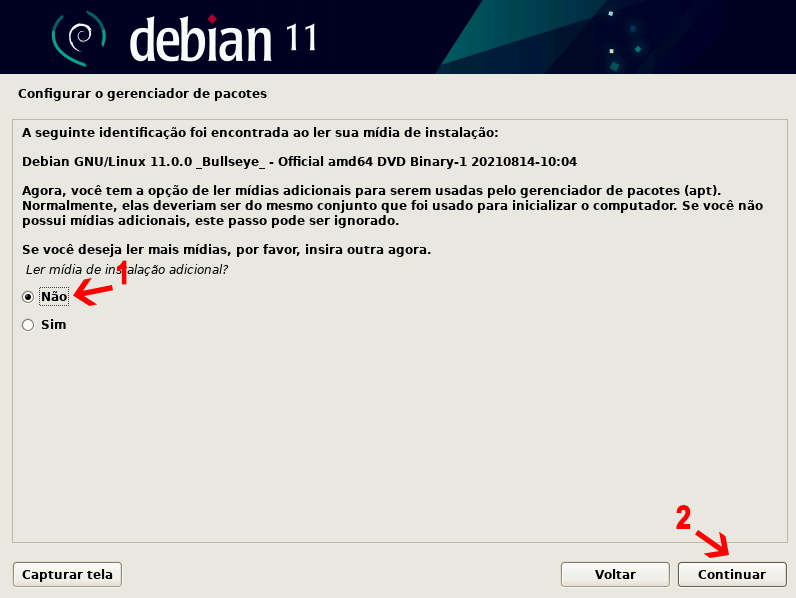
        - 14.2 Marque a opção **SIM** para usar um espelho da rede
        
        - 14.3 Selecione o espelho do repositório de você no nosso caso o **BRASIL** 
        
        - 14.4 Selecione o endereço espelho do repositório Debian normalmente é usado o padrão **deb.debian.org**
        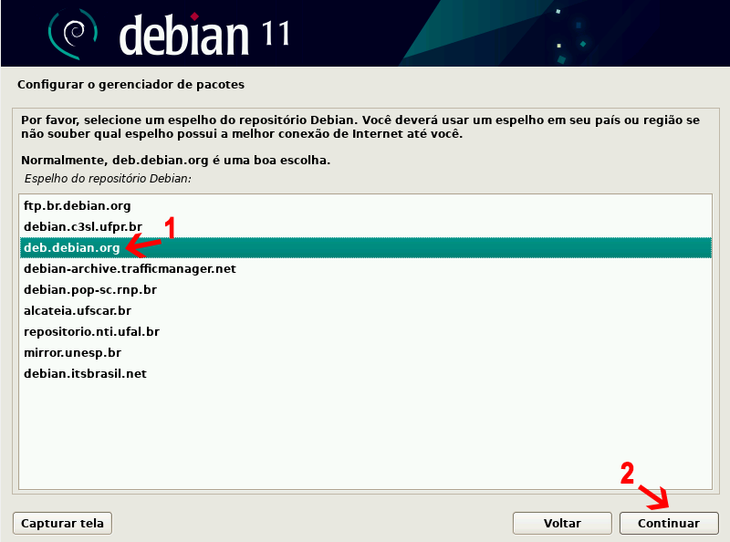
        - 14.5 Se você usar **proxy** para acessar internet informe-o nessa tela **se não deixe em branco**
        
- 15. Configurando popularity-contest para enviar informações sobre os pacotes mais utilizados para o desenvolvedores da distro, para esse roteiro iremos selecionar **NÃO**.
- 16. Selecionar os softwares que irão ser instalados no momento da instalação da distro, como podemos instalar após a instalação vamos selecionar apenas as opções **ambiente de área de trabalho no Debian** e **utilitários de sistema padrão** 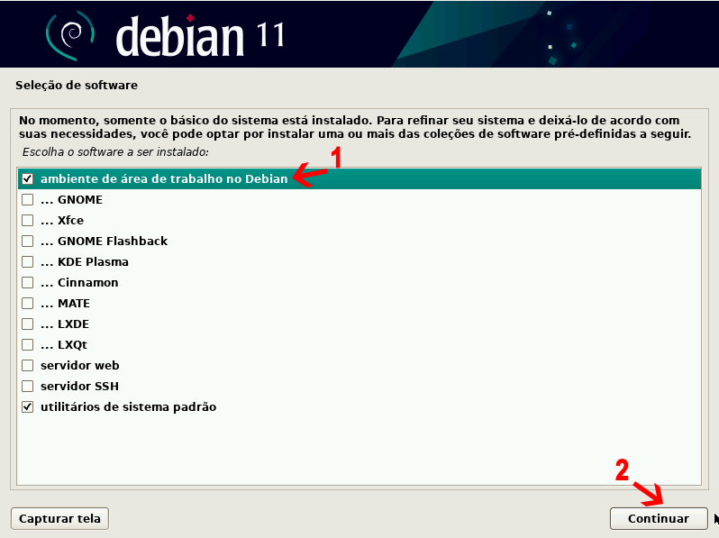
- 17. Vamos instalar o **carregador de inicialização GRUB**, 
        - 17.1 Marque **SIM** e clique em continuar 
        - 17.2 Selecionar o dispositivo que será instalado o GRUB 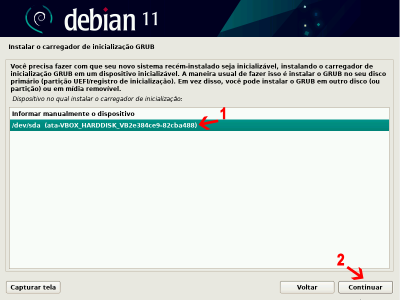
- 18. Após o passo anterior a instalação está completa, o sistema irá reinicializar 
- 19. Na tela do GRUB selecione a opção **Debian GNU/Linux** 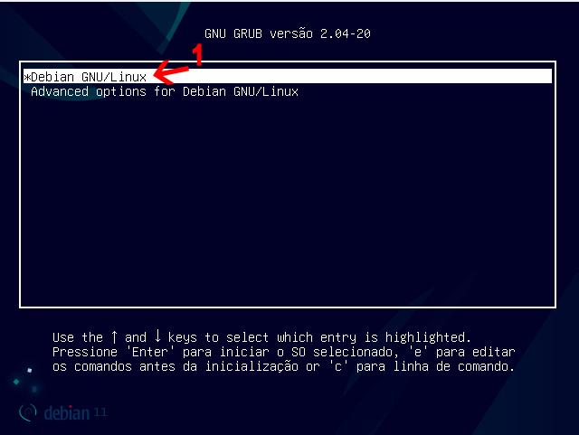

## **Instalação concluida com sucesso**
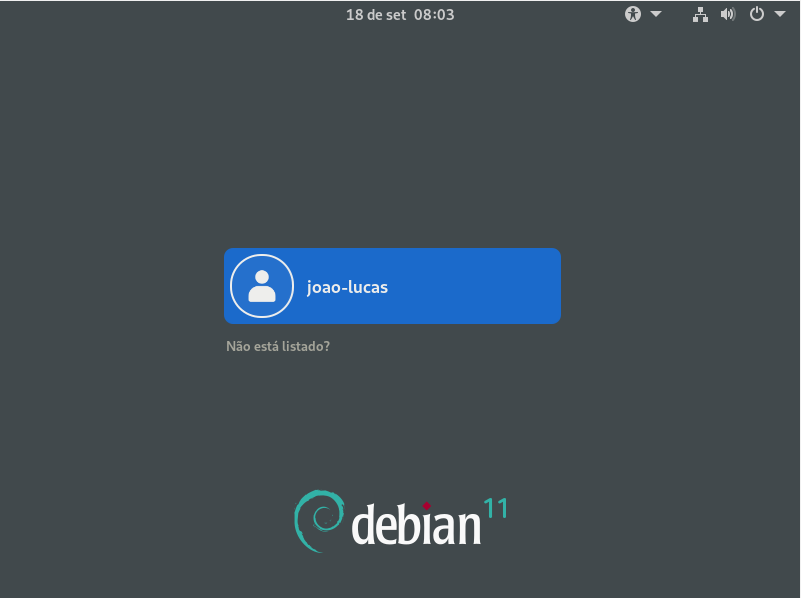
